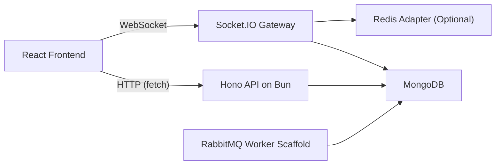

# Ether Chat Case Study

**Live Product:** [https://ais-tau-seven.vercel.app](https://ais-tau-seven.vercel.app)

## 1. Executive Summary

Ether Chat is a full-stack real-time team communication platform built to combine low-latency messaging with a polished product experience. The project was designed as more than a simple chat demo: it includes secure authentication, topic-based channels, member administration, live collaboration signals, unread tracking, and a responsive dashboard-style interface that feels production-oriented.

At a technical level, the system combines:

- A React frontend for navigation, state management, and animated UI.
- A Bun + Hono backend for API routing and protected business logic.
- Socket.IO for real-time channel communication.
- MongoDB with Mongoose for persistence.
- Optional Redis adapter support for scaling socket traffic.
- RabbitMQ-based batch-write scaffolding for future message throughput optimization.

## 2. Problem Statement

Modern team communication tools need to balance three things at the same time:

- Fast, reliable real-time delivery.
- Secure, role-aware access control.
- A clean, premium user experience that scales beyond a toy messaging app.

The goal of Ether Chat was to build a chat application that solves all three together, while keeping the architecture simple enough to iterate on quickly and extensible enough to support future scaling.

## 3. Product Goals

- Enable real-time channel-based messaging for teams.
- Provide secure account creation and login with persistent sessions.
- Support collaboration behaviors users expect from modern chat apps.
- Keep the interface responsive, visually intentional, and easy to navigate.
- Build backend boundaries that make scaling and new features realistic.

## 4. Core Features

### User and Session Management

- User registration with validated inputs.
- Login and logout flows.
- JWT-backed session cookies stored as HTTP-only cookies.
- Protected routes on both frontend and backend.

### Channel Collaboration

- Create channels.
- View joined channels in a collapsible sidebar.
- Add members to a channel.
- Remove members as a channel admin.
- Leave a channel as a non-admin member.
- View a real-time member list with role and presence information.

### Messaging Features

- Real-time message delivery over WebSockets.
- Paginated message history loading.
- Message replies with source-message navigation.
- Message editing with edit-window enforcement.
- Message deletion.
- Emoji reactions with live synchronization.
- Typing indicators.
- Online/offline presence updates.
- Unread message badges per channel.
- Read-state tracking based on the last-read message per user per channel.
- Scroll-to-bottom control for long conversations.

### Product and UX Features

- Landing page and About page with strong product storytelling.
- Sidebar collapse state persisted in local storage.
- Real-time synchronized chat experience with optimistic interactions.
- Responsive layout that separates navigation, conversation, and member context.

## 5. High-Level Design

### System Overview

### High-Level Components

#### Frontend Application

Responsible for:

- Route handling and guarded navigation.
- Channel and message data fetching.
- Rendering the main dashboard and chat workspace.
- Managing optimistic UI updates for interactive chat behavior.
- Maintaining transient UI state such as typing, reply mode, and sidebar collapse.

#### API Layer

Responsible for:

- Registration, login, logout, and `/auth/me`.
- Channel CRUD-style collaboration actions.
- Member management and protected channel access.
- Read-state tracking and unread count aggregation.
- Message history queries, edits, deletions, and server-side validation.

#### Realtime Layer

Responsible for:

- Joining sockets to channel rooms.
- Broadcasting live messages.
- Synchronizing reactions, edits, presence, and typing events.
- Keeping the active chat window aligned with real-time backend state.

#### Persistence Layer

Responsible for:

- Storing users, channels, messages, and last-read state.
- Indexing frequent query paths.
- Supporting message pagination and channel unread calculations.

## 6. Low-Level Design

### Frontend Low-Level Design

#### Routing

The frontend uses TanStack Router with separate routes for:

- `/`
- `/about`
- `/login`
- `/register`
- `/channels/`
- `/channels/$channelId`

Route guards call `/auth/me` before allowing access to authenticated pages.

#### Layout Composition

`MainLayout` provides the main workspace shell:

- Left: `UserChannels`
- Center: routed content, including `ChatArea`

This makes navigation persistent while the chat panel changes based on route.

#### `UserChannels` Responsibilities

- Fetch joined channels from `/channels/user`.
- Render the collapsible channel sidebar.
- Display unread badges.
- Persist the collapsed/expanded state in local storage.
- Provide quick entry into channels and channel creation flow.

#### `ChatArea` Responsibilities

- Fetch channel metadata and message history.
- Open and maintain a Socket.IO connection.
- Join the active channel room.
- Render a processed message list with separators and grouping.
- Support edit, delete, reply, react, and typing behavior.
- Mark the active channel as read on load and while receiving new messages.
- Show scroll-to-bottom affordance when the user is away from the latest messages.

#### Client State Model

The chat view intentionally blends:

- React Query state for fetched server data.
- Local state for real-time and optimistic interactions.

This allows:

- Fast first render from cached query data.
- Immediate UI updates before the next server round-trip.
- Reconciliation from canonical socket events after server processing.

### Backend Low-Level Design

#### Authentication Flow

- `POST /auth/register`
- `POST /auth/login`
- `GET /auth/me`
- `POST /auth/logout`

Passwords are hashed with Bun’s password utilities. Successful auth responses set a `user_auth` cookie configured as HTTP-only and environment-aware for security.

#### Auth Middleware

The backend uses a shared auth middleware that:

- Reads the auth cookie.
- Validates the JWT.
- Loads the associated user.
- Injects the authenticated user into the Hono request context.

Protected routes reject unauthorized access early.

#### Data Models

##### User

- `name`
- `email`
- `password`
- timestamps

##### Channel

- `name`
- `members`
- `admin`
- timestamps

##### Message

- `content`
- `author`
- `channelId`
- `replyTo`
- `reactions`
- timestamps

Indexes:

- `channelId + createdAt` for efficient message history queries

##### LastRead

- `userId`
- `channelId`
- `lastReadMessageId`
- `lastReadAt`
- timestamps

Unique key:

- `(userId, channelId)`

This model supports unread-count calculation without altering the existing channel membership structure.

#### Channel Routes

The backend exposes endpoints for:

- Channel creation
- Joined channel listing
- Channel metadata
- Message history
- Member listing
- Add member
- Remove member
- Leave channel
- Mark channel as read
- Edit message
- Delete message

#### Message History Design

Message history uses cursor-style pagination based on `_id` ordering:

- Default fetch returns the latest page.
- Older history is fetched using `before=<oldestMessageId>`.
- Results are sorted descending in the database and reversed for chronological rendering.

#### Realtime Design

Socket responsibilities include:

- Handshake authentication using the cookie token.
- Room join with membership validation.
- Live channel message broadcast.
- Reaction synchronization.
- Typing indicator broadcast.
- Online/offline presence fan-out to relevant channels.

The socket layer is designed to work without Redis in single-instance mode and can enable a Redis adapter when `REDIS_URI` is configured.

## 7. Key End-to-End Flows

### Flow 1: Register and Enter the Product

1. User submits registration form.
2. Backend validates input and creates the user.
3. Password is hashed before persistence.
4. JWT is issued and stored in an HTTP-only cookie.
5. Frontend redirects the user into the authenticated area.

### Flow 2: Open a Channel

1. User selects a channel in the sidebar.
2. Frontend route changes to `/channels/$channelId`.
3. `ChatArea` fetches metadata and recent messages.
4. Socket joins the corresponding channel room.
5. Latest visible message is marked as read.
6. Sidebar unread badge is cleared for the active channel.

### Flow 3: Send a Message

1. User submits message text.
2. Frontend emits `chat_message` over Socket.IO.
3. Backend validates payload and stores the message.
4. Backend broadcasts the message to channel members.
5. Sender appends the acked message locally.
6. Active channel read state is updated.

### Flow 4: Receive a Real-Time Message

1. Socket receives `channel_message`.
2. `ChatArea` appends the message to the local list.
3. If the channel is currently open, the channel is marked as read.
4. If the channel is not open, unread count persists in the sidebar.

### Flow 5: React to a Message

1. User clicks an emoji reaction.
2. Client applies an optimistic local reaction update.
3. Socket emits `react_message`.
4. Backend toggles the reaction on the canonical message document.
5. Server broadcasts the normalized reaction state back to the room.
6. Clients reconcile to the server state.

## 8. Architectural Decisions and Tradeoffs

### Why Separate HTTP APIs and WebSocket Events?

HTTP is better for:

- Authentication
- Initial data loads
- Protected resource access
- Recoverable, inspectable request/response flows

Sockets are better for:

- Instant message delivery
- Presence
- Typing
- Cross-user synchronization

This split keeps the design clear and avoids forcing everything through a single transport.

### Why Use a Dedicated `LastRead` Model?

The channel schema originally stored members as a flat list of user IDs. Extending that into embedded membership metadata would require reshaping the document structure and a broader refactor.

A separate `LastRead` collection provides:

- Minimal disruption to existing channel logic
- Clean unread tracking
- A future-friendly place for per-user channel metadata

### Why Keep Local Chat State Alongside React Query?

Pure query-driven chat rendering is slower for real-time UX because every interaction must wait for refetches or cache rewrites.

The chosen design allows:

- Fast initial hydration from cached server data
- Optimistic interactions
- Reconciliation from live socket events

The tradeoff is that channel-switch and cache interaction must be handled carefully, which is why the chat route now remounts the chat component per channel.

## 9. Performance Considerations

- WebSocket transport is used for real-time delivery.
- Messages are indexed by channel and creation time.
- Message history is paginated instead of loading full conversation logs.
- Socket rooms limit fan-out scope to relevant channels.
- Sidebar preferences are persisted locally to avoid unnecessary UI churn.
- The client was refined to reduce unnecessary rerenders and avoid scroll jank during reactions.
- Optional Redis adapter support prepares the realtime layer for multi-instance scaling.

## 10. Security Considerations

- HTTP-only auth cookies reduce token exposure in client-side JavaScript.
- Passwords are hashed before storage.
- Protected channel APIs enforce membership checks.
- Socket handshakes validate the auth cookie before allowing a live connection.
- Channel room joins are validated against membership on the server.
- Message editing and deletion enforce author/admin rules.

## 11. Challenges Solved During Development

### Real-Time State Synchronization

One of the core challenges was keeping server state, socket state, React Query state, and local optimistic state aligned. This surfaced in areas like:

- Reaction correctness
- Channel switching
- Unread badge clearing
- Auto-scroll behavior

### Channel Navigation Consistency

The chat panel maintains a large amount of local state. Reusing the same component instance across channel switches created subtle lifecycle bugs, especially when cached queries and live socket updates interacted. The route was later adjusted to remount the chat panel per channel for stronger isolation.

### Unread Tracking Without Refactoring Membership

Unread counts were added without redesigning the channel schema by introducing a dedicated per-user-per-channel last-read model.

### Sidebar UX Polish

Persisted sidebar collapse state initially caused layout shift on render. The loading and error states were adjusted to respect the current collapsed width from the first paint.

## 12. What Makes the Project Strong

- It solves both product and systems problems, not only UI or only backend concerns.
- It includes realistic team-collaboration workflows rather than basic one-room chat.
- It shows thoughtful architecture around realtime communication, auth, unread state, and UI synchronization.
- It demonstrates iterative engineering: bugs found during live behavior were tracked down and corrected with targeted structural fixes.

## 13. Future Improvements

- Per-message delivery/read receipts beyond channel-level unread counts.
- Full-text message search.
- File and media attachments.
- Richer moderation and admin audit controls.
- Channel-level notification preferences.
- Better analytics around activity and retention.
- Full horizontal scaling with Redis and dedicated background workers.

## 14. Final Outcome

Ether Chat evolved into a credible real-time collaboration product with:

- Secure account flows
- Topic-based team channels
- Live messaging and interaction signals
- Member and admin controls
- Unread tracking
- Responsive product-grade interface
- Scalable architectural extension points

It demonstrates end-to-end ownership of product design, frontend engineering, backend services, realtime communication, and data modeling in a single cohesive system.
